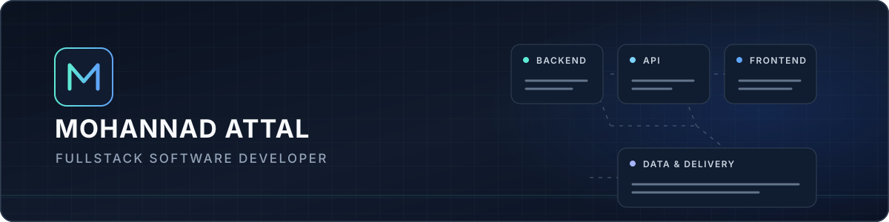

  
  

    <strong>Building dependable backend systems and polished web interfaces.</strong> 
    Duisburg, Germany
  

I develop full-stack applications from API and data-layer design through responsive frontend experiences, with an emphasis on clear architecture, reliable behavior, and maintainable software.

## Core stack

<table>
  <tr>
    <td width="33.33%" valign="top">
      <strong>Backend</strong>  
      Java&nbsp;·&nbsp;Spring&nbsp;Boot 
      Python&nbsp;·&nbsp;FastAPI 
      Node.js
    </td>
    <td width="33.33%" valign="top">
      <strong>Frontend</strong>  
      TypeScript&nbsp;·&nbsp;JavaScript 
      Angular&nbsp;·&nbsp;React
    </td>
    <td width="33.33%" valign="top">
      <strong>Data &amp; Delivery</strong>  
      SQL&nbsp;·&nbsp;MySQL 
      Docker&nbsp;·&nbsp;Git 
      CI&nbsp;workflows&nbsp;·&nbsp;automated&nbsp;testing
    </td>
  </tr>
</table>

## Featured work

### [PulseDesk — Service Desk Platform](https://github.com/Mohannadattal/pulsedesk)

PulseDesk is a portfolio-grade, modular full-stack ticket and service-desk application. It connects a responsive Angular client to a FastAPI service and MySQL data layer, with a separate worker for reliable email delivery.

**Angular · TypeScript · FastAPI · Python · MySQL · Docker Compose**

<table>
  <tr>
    <td width="50%" valign="top">
      <strong>Architecture</strong>  
      Role-aware workflows, a forward-only ticket lifecycle, and clear router, service, and repository responsibilities.
    </td>
    <td width="50%" valign="top">
      <strong>Security</strong>  
      JWT authentication, token-purpose checks, and session invalidation for security-sensitive account changes.
    </td>
  </tr>
  <tr>
    <td width="50%" valign="top">
      <strong>Reliability</strong>  
      A transactional outbox, independent email worker, and concurrency-aware MySQL operations.
    </td>
    <td width="50%" valign="top">
      <strong>Delivery &amp; Quality</strong>  
      Dockerized setup, CI, automated backend, frontend, and integration tests, plus operational documentation.
    </td>
  </tr>
</table>

**[Explore PulseDesk →](https://github.com/Mohannadattal/pulsedesk)**

## Engineering approach

I favor explicit responsibilities, tested behavior, deployment-aware decisions, and interfaces that make complex workflows feel straightforward.

## Let's connect

Duisburg, Germany · [mohannadattal85@web.de](mailto:mohannadattal85@web.de)
